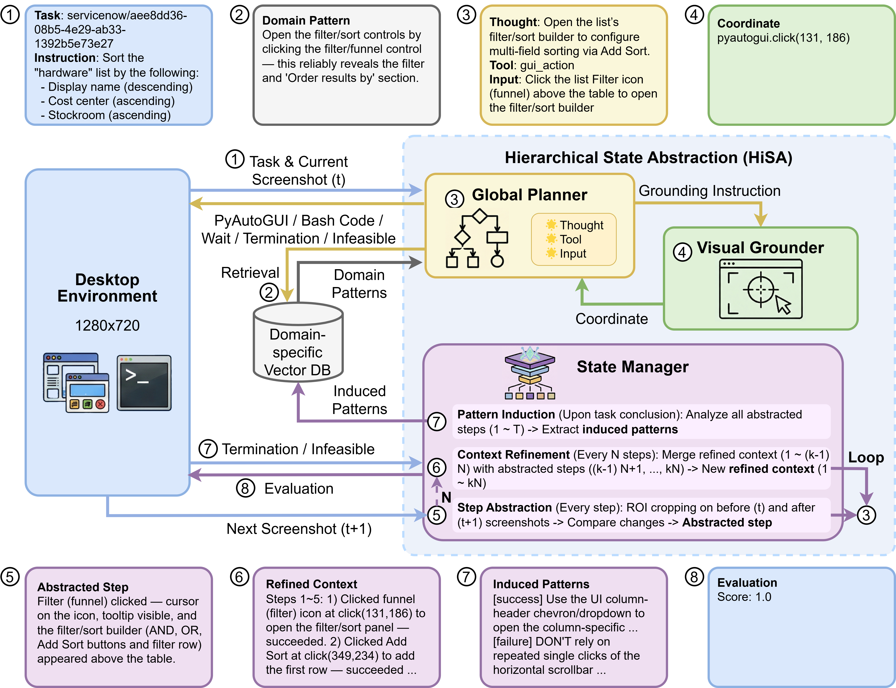

# HiSA: Hierarchical State Abstraction for Scalable GUI Agents

This repository contains the code for the paper *HiSA: Hierarchical State Abstraction for Scalable GUI Agents*

## 📖 Introduction

Multimodal GUI agents generally operate on raw visual and textual observations, creating a fundamental scalability challenge. While current state-of-the-art frameworks predominantly rely on inference-intensive test-time scaling or the accumulation of unbounded raw logs to maintain task coherence, we attribute the underlying bottleneck to the lack of effective state abstraction.
To address this, we introduce Hierarchical State Abstraction (HiSA), a framework that prioritizes active knowledge restructuring over passive history retention by transforming raw history into a three-level hierarchy of Step Abstracts, Refined Context, and Induced Patterns.
By synthesizing high-dimensional observations into these compact semantic states, HiSA decouples reasoning efficacy from context length.
On the Spider2-V benchmark, our method establishes a new state-of-the-art with a 40.58\% success rate while reducing token consumption by 69.85\% and monetary costs by 55.10\% compared to the best-performing baseline.

## 🏗️ Architecture

<div align="center">

</div>

The HiSA framework decouples the agent architecture into three specialized modules.

* **Global Planner**
This module serves as the high-level reasoning engine utilizing a unified multimodal context.
* **Visual Grounder**
This module maps semantic descriptions to precise pixel coordinates.
* **State Manager**
This module orchestrates the abstraction logic and restructures context through Step Abstraction, Context Refinement and Pattern Induction.

## 📊 Performance

HiSA establishes a new state-of-the-art on the Spider2-V benchmark with a 40.58% success rate while reducing token consumption by 69.85% compared to the best-performing baseline.

### 🕷️ Spider2-V Abstract Subset

| Method | LLM Backbone | Max Steps | SR (%) | Cost ($) | Tokens Total (K) | Tokens Input (K) | Tokens Output (K) | Steps |
| --- | --- | --- | --- | --- | --- | --- | --- | --- |
| Spider2-V Agent | GPT-4V | 15 | 11.30 | - | - | - | - | - |
| CoAct-1 | GPT-5 | 50 | 23.67 | 0.75 | 526.25 | 472.74 | 53.51 | 28.84 |
| GTA1 | GPT-5 | 50 | 31.72 | 3.79 | 1115.30 | 835.94 | 279.37 | 26.17 |
| Agent S3 | GPT-5 | 50 | 38.96 | 0.98 | 607.18 | 575.89 | 31.29 | 23.82 |
| **HiSA (Ours)** | **GPT-5** | **50** | **40.58** | **0.44** | **183.05** | **141.30** | **41.75** | **15.34** |
| Human | - | - | 47.66 | - | - | - | - | 10.98 |

### 🖥️ OSWorld

| Method | LLM Backbone | Success Rate @ 50 Steps | Success Rate @ 100 Steps |
| --- | --- | --- | --- |
| UI-TARS-1.5-7B | UI-TARS-1.5-7B | - | 27.4% |
| Agent S2 | Gemini-2.5-Pro | 45.8% | - |
| Agent S2 | GPT-5 | 46.3% | 48.8% |
| Jedi-7B | o3 | 50.6% | 51.0% |
| GTA1-7B | o3 | 48.6% | 53.1% |
| Agent S2.5 | o3 | 54.2% | 56.0% |
| GTA1-32B | o3 | - | 55.4% |
| CoAct-1 | o3 | 56.4% | 59.9% |
| Agent S2.5 | GPT-5 | - | 58.4% |
| GTA1-7B | GPT-5 | - | 61.0% |
| GTA1-32B | GPT-5 | - | 62.0% |
| Agent S3 | GPT-5 | 61.1% | 62.6% |
| Agent S3 w/ bBoN | GPT-5 | 63.5% | 69.9% |
| **HiSA (Ours)** | **GPT-5** | **58.7%** | **59.3%** |

## 🛠️ Installation

This tutorial is verified on Windows only. 

Please create a conda environment and install the dependencies using the following commands.
```bash
conda create -n hisa python=3.11
conda activate hisa
pip install -r requirements.txt
```

Please configure the OpenAI API key environment variable before running the agent.
```bash
export OPENAI_API_KEY=your_api_key
```

## 🚀 Model Deployment

### Vector Database and Embedding

We recommend setting Qdrant to server mode to support multiple environments as local settings only support a single environment. Please refer to the official documentation for configuration.

[https://github.com/qdrant/qdrant](https://github.com/qdrant/qdrant)

For the BGE-M3 embedding service please refer to the FlagEmbedding guide.

[https://github.com/FlagOpen/FlagEmbedding](https://github.com/FlagOpen/FlagEmbedding)

Start the embedding service with the following script.
```bash
python embedding.py
```

### Local VLM Deployment

Download the model parameters for UI-TARS-1.5-7B and GTA1-7B from HuggingFace.

* [https://huggingface.co/ByteDance-Seed/UI-TARS-1.5-7B](https://huggingface.co/ByteDance-Seed/UI-TARS-1.5-7B)
* [https://huggingface.co/HelloKKMe/GTA1-7B](https://huggingface.co/HelloKKMe/GTA1-7B)

Launch the GTA1-7B server.
```bash
python -m vllm.entrypoints.openai.api_server --served-model-name gta1-7b --model /path/to/GTA1-7B --port 1234
```

Launch the UI-TARS-1.5-7B server.
```bash
python -m vllm.entrypoints.openai.api_server --served-model-name uitars-1.5-7b --model /path/to/UI-TARS-1.5-7B --port 1235
```

## ⚡ Environment Setup

Run the automated setup script:
```bash
./scripts/setup_benchmarks.sh
```

This will:
1. Clone Spider2-V and OSWorld repositories
2. Copy HiSA-specific modifications from `setup/` directory

### Spider2-V Setup

We primarily evaluate performance on the Abstract subset of Spider2-V while excluding 40 tasks involving DBT and BigQuery due to 2FA constraints. Please refer to the official github for the initial environment setup.

[https://github.com/xlang-ai/Spider2-V](https://github.com/xlang-ai/Spider2-V)

For ServiceNow tasks please use the new configuration method from WorkArena as the original Spider2-V setup is deprecated. Follow the instruction below.

[https://github.com/ServiceNow/WorkArena](https://github.com/ServiceNow/WorkArena)

The setup script already copies modifications from `setup/Spider2-V/` to `benchmarks/Spider2-V/`. These modifications are necessary to fix session timeouts and enable dynamic resolution setting for the HiSA framework. Specific file changes are listed in the table below.

| File | Modification Scope |
| --- | --- |
| **desktop_env/configs/servicenow.py** | Implements session keep-alive logic to prevent connection drops and extends DOM loading timeouts. Adds retry mechanisms for network delays and resolves asyncio compatibility issues. |
| **desktop_env/configs/snowflake.py** | Optimizes the login flow by removing redundant steps and utilizing generic selectors. Dynamically retrieves account URLs from configuration to improve reliability. |
| **desktop_env/controllers/python.py** | Introduces robust retry mechanisms for command execution and adds new interfaces for running Python and Bash scripts with timeout controls. |
| **desktop_env/controllers/setup.py** | Integrates screen resolution placeholders to support dynamic resizing via xrandr or GNOME settings. |
| **desktop_env/envs/desktop_env.py** | Extends execution timeouts to 600 seconds and enforces screen resolution verification. Implements VMware lock file cleaning to ensure multi-process safety. |
| **desktop_env/server/main.py** | Exposes new API endpoints to support the remote execution of Python and Bash scripts across different operating systems. |

You need to configure a specific snapshot for HiSA. Launch the virtual machine by opening the configuration file at `Spider2-V/vm_data/Ubuntu0/Ubuntu0/Ubuntu0.vmx` and replace the content of `/home/user/server/main.py` inside the virtual machine with the updated code located at `setup/Spider2-V/desktop_env/server/main.py`. This step is mandatory to enable the server bash execution capability required by the agent. Open the terminal and execute the restart command using `password` as the sudo password.
```bash
sudo systemctl restart osworld_server@:0.service
```

Finally save the snapshot. You may name it `config` or any other identifier provided that you specify the corresponding name via the `--snapshot` argument when executing `run_all.py`.

### OSWorld Setup

We also employ OSWorld to assess open-ended generalization. Please refer to the official github for the initial environment setup.

[https://github.com/xlang-ai/OSWorld](https://github.com/xlang-ai/OSWorld)

The setup script already copies modifications from `setup/OSWorld/` to `benchmarks/OSWorld/`. These modifications are essential for automating resolution configuration and preventing VMware lock contention which frequently causes failures during repeated VM restarts. Specific file changes are listed in the table below.

| File | Modification Scope |
| --- | --- |
| **desktop_env/controllers/setup.py** | Stabilizes setup-side file and auth configuration handling, including reliable path resolution for settings-based integrations. |
| **desktop_env/desktop_env.py** | Adds environment readiness checks during reset so a supposedly clean environment is restarted if the desktop server is actually unreachable. |
| **desktop_env/providers/vmware/provider.py** | Hardens the VMware lifecycle with startup retries, lock-file cleanup, IP acquisition recovery, and hard poweroff fallback for stuck instances. |
| **desktop_env/server/main.py** | Provides the command execution and verification endpoints required by the setup/controller pipeline. |

You need to configure a specific snapshot for HiSA. Launch the virtual machine by opening the configuration file at `OSWorld/vmware_vm_data/Ubuntu0/Ubuntu0.vmx` and replace the content of `/home/user/server/main.py` inside the virtual machine with the updated code located at `setup/OSWorld/desktop_env/server/main.py`. The original main.py raises an exception during bash code execution, the updated one resolves this. Open the terminal and execute the restart command using `password` as the sudo password.
```bash
sudo systemctl restart osworld.service
```

Finally save the snapshot. You may name it `config` or any other identifier provided that you specify the corresponding name via the `--snapshot` argument when executing `run_all.py`.

## 🏃 Usage

We provide scripts to run HiSA and baseline methods. All scripts are located in the `scripts/` directory.

Run HiSA:
```bash
./scripts/run_hisa.sh
```

Run Baseline such as GTA1:
```bash
./scripts/run_gta1.sh
# ... other baseline scripts available in scripts/
```

For manual execution, refer to the `run` function in `benchmarks/Spider2-V/run_all.py` or `benchmarks/OSWorld/run_all.py` for detailed parameter descriptions. Example manual execution:
```bash
python run_all.py --method hisa --result_dir results/hsa_gpt5_gta1_50 --snapshot config --global_planner_model gpt-5 --state_manager_model gpt-5-mini --visual_grounder_model gta1-7b --use_qdrant_server --max_steps 50 --test_all_meta_path evaluation_examples/test_abstract.json --headless
```

## 🧩 Acknowledgements

We incorporate specific prompts regarding software operation guidelines from [Agent S3](https://github.com/simular-ai/Agent-S). Additionally, the bash code execution logic is adapted from [CoAct-1](https://github.com/SalesforceAIResearch/CoAct-1).
